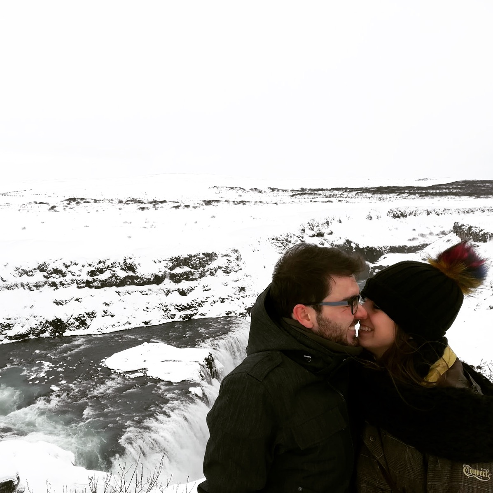

# Boda - Andrea & Dani (sitio estático)

Este repositorio contiene la web estática de la boda. Está lista para subir a GitHub y desplegar en Vercel.

## Estructura
- `index.html` - Página principal.
- `gracias.html` - Página de agradecimiento tras enviar formularios.
- `images/` - Carpeta con las fotos (incluye `foto1.JPG` como cabecera).

## Cómo añadir fotos a la galería
1. Sube tus imágenes a la carpeta `images/` con nombre **exacto** `foto2.JPG`, `foto3.JPG`, etc (las mayúsculas importan).
2. En `index.html` busca el bloque `<div id="gallery" class="gallery">` y copia una línea como esta por cada foto nueva:
   ```html
   
   ```
3. Guarda y sube los cambios a GitHub: Vercel redeplegará automáticamente.

## Cambiar colores o textos
- Abre `index.html` y en la sección `<style>` modifica las variables CSS `--vino` y `--rosa` para ajustar los colores.
- El título y los textos están en el HTML principal y puedes editarlos directamente.

## Despliegue en Vercel
1. Crea un nuevo repositorio en GitHub y sube los archivos (arrastrando el contenido del ZIP).
2. Conecta Vercel a tu cuenta de GitHub y añade el repositorio (Vercel detectará que es un sitio estático).
3. Pulsa *Deploy* y tu sitio quedará online.
